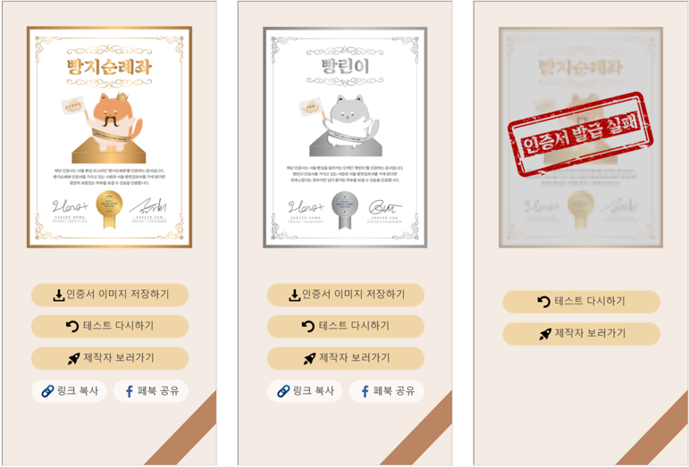

## 서울 빵 맛집 잘알 테스트
> 도킹프로젝트 첫번째, 아리랑 1호 - 빵전문가를 판별해주는 심리테스트 서비스

## Live Link
👉 (서비스종료) 서울 빵 맛집 잘알 테스트 하러가기

## Status
<!--  -->

## About the Project
자칭 빵 맛집 전문가들은 뚜렷한 인증제도가 없어서 쉽사리 무시되곤 한다. 빵을 사랑하고 세상의 모든 빵 맛집을 꿰뚫고 있는 그들에게 빵 전문가 자격증을 발급해줌으로서 자존감을 회복할 수 있는 계기를 마련하고자 했다.

## Screenshots

## Technologies Used

## Journey
> 작업자 두 명 모두 직장인인 관계로 8월부터 10월까지 틈날때마다 조금씩 작업을 진행

### 2021.08 
- 아이디어 구상
- 서비스 기획
- 빵지순례좌 질문지 제작
- 필요한 기술검토
- 개발설계
### 2021.09 
- 디자인 UX/UI 
- 도킹프로젝트 소개글 작성
- 프론트 기술 공부 : `javascript`, `reactJS`, `styled-components`, `aws-amplify`
- 프론트 & 백엔드 개발 진행
### 2021.10
- 개발보완
- QA
- 릴리즈

## Result 

### 마케팅
- 테스트 내에 등장하는 빵집 40여곳에 인스타그램 DM 을 보내 참여 유도 
- 직장인이 가장 힘들어하는 시간인 점심시간 직후를 노려 카톡 내 친한 지인들에게 링크 전파! 유흥거리를 제공함
- 객관적인 평을 듣고 싶어서 테스트 전이나 후에 본인이 제작한 것임을 밝히지 않음

### 최종 결과 
- 총 방문자수 : 2,200명
- 총 참여건수 : 2,069건
- DM 을 보냈던 빵집에서는 빵을 직접 보내주시겠다고 한 곳도 있었고, 80% 정도의 빵집에서는 감사하다는 피드백을 받을 수 있었다.
- 참여했던 지인들 중에서는 너무 어렵다는 평이 많았으며, 빵 전문가인 빵지슐레좌 인증서를 받기 위해서 여러번 시도한 사람들도 있었다.

## Thanks to
- 자바스크립트, 리엑트 문외한이 한 달만에 테스트 사이트를 제작할 수 있게 도와주신 [벨로퍼트](https://react.vlpt.us) 님, 감사합니다 🙏
- 게으른 개발자를 열심히 케어해주신 공동작업자님, 감사합니다 🙏

## Authors
- 
- 

## Related Repository
👉 (비공개) 서울 빵 맛집 잘알 테스트 Backend Repository
